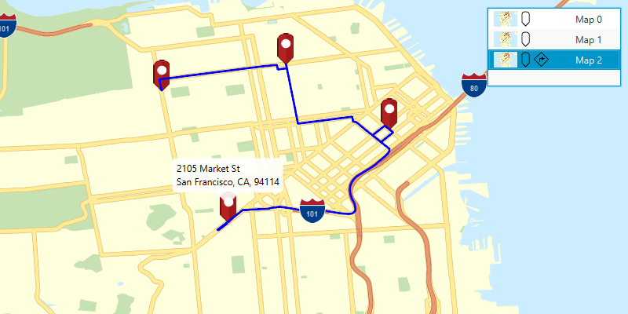

# Mobile map (search and route)

Display maps and use locators to enable search and routing offline using a mobile map package.

## Use case

Mobile map packages make it easy to transmit and store the necessary components for an offline map experience including: transportation networks (for routing/navigation), locators (address search, forward and reverse geocoding), and maps. 

A field worker might download a mobile map package to support their operations while working offline, for example to navigate remote oil field roads.

## How to use the sample

Click the "Open mobile map package" button to bring up a file choosing dialog. Browse to and select a .mmpk file. When chosen, the maps inside the mobile map package will be displayed in a list view. Click on a map in the list to open it. 

If the mobile map package has a locator task, the list items will have a pin icon. Click on the map to reverse geocode the clicked locations's address if a locator task is available. 

If the map contains transportation networks, it will have a navigation icon. Click on the map to add locations. If transportation networks are available, a route will be calculated between  locations.

## How it works

1. Create a `MobileMapPackage` passing in the path to the local mmpk file.
2. Get a list of maps inside the package with `mobileMapPackage.getMaps()`.
3. If the package has a locator, access it with `mobileMapPackage.getLocatorTask()`.
4. To see if a map contains transportation networks, call `map.getTransportationNetworks()`. Each `TransportationNetworkDataset` can be used to construct a `RouteTask`.

## Relevant API

* GeocodeResult
* MobileMapPackage
* ReverseGeocodeParameters
* Route
* RouteParameters
* RouteResult
* RouteTask
* TransportationNetworkDataset

## Tags

disconnected, field mobility, geocode, network, network analysis, offline, routing, search, transportation
